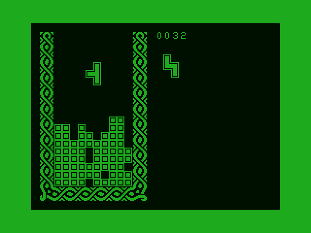

# Simple Tetris for Dragon 32

This is an assembly-language port of Tetris to the Dragon 32, I think
from some time in the late 1980s.  I thought it would be fun to dust
this off, and was able to extract the first few versions from a
cassette tape.

After some reformatting, these version became the commits labelled as
coming from "TETn".  When I got the code working in the state it was
back then, I spotted a bug and a couple of opportunities for new
features.

The world doesn't really need yet another Tetris clone, but here we
are anyway.




## Running the game

Under Linux, I used the following:

* [The `asm6809` assembler](https://www.6809.org.uk/asm6809/).
  Follows its build instructions and put the `asm6809` binary
  somewhere in your PATH.  The command `asm6809` should run, albeit
  with the error "no input files" if you run it just by itself.

* [The XRoar emulator](https://www.6809.org.uk/xroar/).  Follow its
  build instructions, put the `xroar` binary in your PATH, download a
  ROM image as described in the XRoar docs, and make sure the command
  `xroar` runs successfully.

* [The `bin2cas.pl` utility](https://www.6809.org.uk/dragon/).
  Download the Perl script (under the heading "CAS tools" at the
  link), make it executable, and place it somewhere in your PATH.
  Make sure the command `bin2cas.pl` runs OK; it should say "No output
  filename specified" if just you run `bin2cas.pl` by itself.

These are strung together in the `build-and-run.sh` script here.  For
automatically assembling and running the program on every change to
the source `tetris.s` file, the
[`entr`](https://github.com/eradman/entr) utility is very useful, with
the command

``` shell
echo tetris.s | entr -r ./build-and-run.sh
```


## Playing the game

The game boots with a spinning "T" piece.  Press a key to start a
game.  Left and right arrow keys move your piece.  Spacebar rotates
it.  Down-arrow drops the piece as far as it will go.  When the game
is over, the spinning "T" piece returns.  Press a key to start the
next game.
